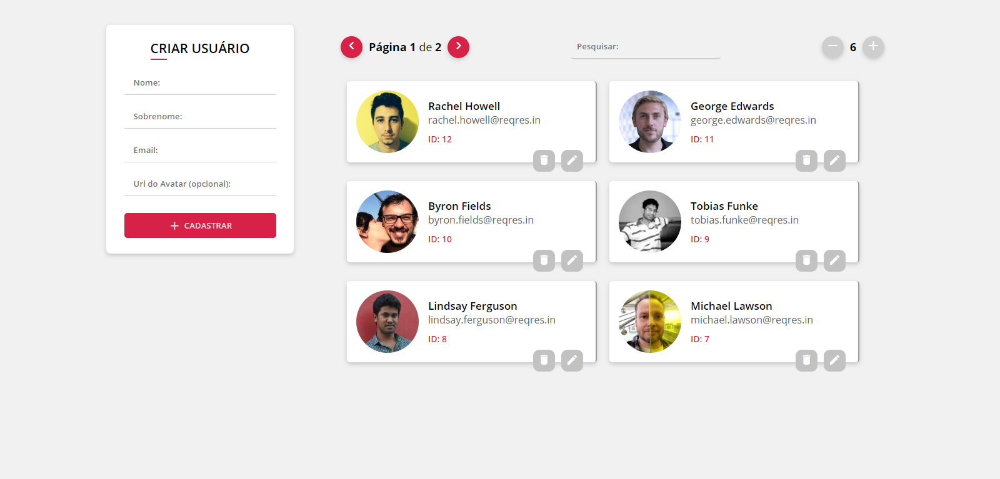
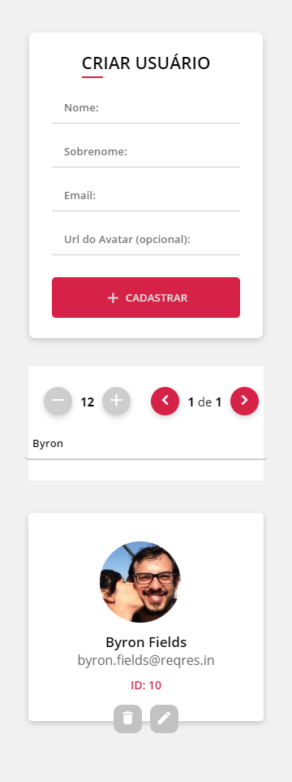

<h1 align="center">
    
</h1>

<h2 align="center">
  💡 Project Reqres.in
</h2>

  <a href="#layout">Layout</a>&nbsp;&nbsp;&nbsp;|&nbsp;&nbsp;&nbsp;
  <a href="#tecnologias">Tecnologias</a>&nbsp;&nbsp;&nbsp;|&nbsp;&nbsp;&nbsp;
  <a href="#como-rodar">Como rodar</a>&nbsp;&nbsp;&nbsp;|&nbsp;&nbsp;&nbsp;
  <a href="#projeto">Projeto</a>&nbsp;&nbsp;&nbsp;

 

## Layout

Algumas imagens do projeto:

  
  

---
## Documentação

O Projeto é dividido em páginas e components, sendo a estrutura: 
- **src**
  - **pages**: Contém as páginas do projeto, no caso é uma apenas chamada Home
    - **Home/index**: Arquivo principal do projeto, contendo as variáveis de estado
    - **Home/components/**: Contém as partes do layout
  - **services**:
    - **Api & getFirstData**: Responsáveis por fazer a conexão com a camada de dados e retornar os mesmos
  - **validation**:
    - **yup**: Responsável por trabalhar com os erros de validação

---

## Tecnologias

Esse projeto foi desenvolvido com as seguintes tecnologias:

- [Node.js](https://nodejs.org/en/)
- [React](https://reactjs.org)

**Dependências**
- [Axios](https://github.com/axios/axios) para requisições
- [Sweetalert2](https://sweetalert2.github.io/) para pop-ups
- [Yup](https://github.com/jquense/yup) para validação de campos

---

## Como Rodar
- Primeiramente certifique de que possui o **NodeJs** e o **Npm** instalado em seu sistema.
 

**Iniciar Projeto**:
- Instale as dependências utilizando o comando <b>npm i</b>
- Rode o comando <b>npm start</b>
- **Dica**: Você pode vizualizar o projeto em seu celular acessando o **http://ip_da_sua_maquina:3000**

---

## Projeto

Esse projeto foi desenvolvido durante um teste para uma vaga de emprego em desenvolvimento front-end
- <b>Layout Web</b>
- <b>Layout Mobile</b>

---

Feito com ♥ by AlexDjonata
